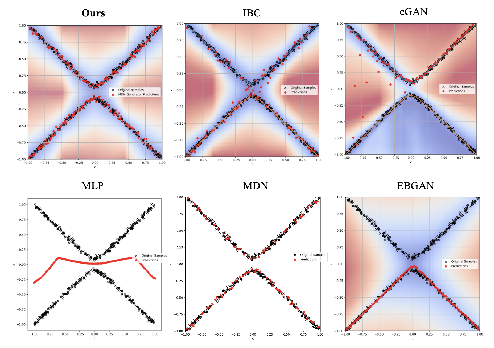

# Background
Behavior cloning (BC) is a cornerstone approach for robotic policy learning from demonstrations. However, BC often struggles with multimodal datasets where multiple valid actions exist for the same state. For instance, the Inverse Kinematics can have multiple solutions. 

This project tries to investigate this issue by testing on several problems: multi-value function, 2 link arm IK and UR5 robot IK.



*Comparison of mode collapse and mode averaging. (a) Mode collapse in a Vanilla cGAN model, which fails to capture diverse modes in the data. (b) Mode averaging using the Explicit BC model which produces unrealistic samples.*


# Installation

Create virtual environment and
```sh
pip install -r requirements.txt
```

# Date generation

There are two different problems here: 2 linkage Inverse Kinematics and UR5 Inverse Kinematics.

To generate data for the planar 2-linkage robot arm, you can use one of the following methods: `analytical`, `gradient`, or `incremental`. Each method generates data differently and saves it to the specified path.

1. **Analytical Method**:
    ```sh
    python data_pipeline.py --problem 2link --method analytical --num_samples 2000 --save_path data/
    ```

2. **Gradient Descent Method**:
    ```sh
    python data_pipeline.py --problem 2link --method gradient --num_samples 2000 --save_path data/
    ```

3. **Incremental Sampling Method**:
    ```sh
    python data_pipeline.py --problem 2link --method incremental --num_samples 2000 --save_path data/
    ```

The generated data will be saved in the specified directory (`data/` by default).

# Training

This script trains models using various methods from the `methods` folder. Specify the method and data file via command-line arguments.


Run the script with the following options:
- `--method` (default: `mlp`): Training method (`mlp`, `cgan`, `cvae`, `reinforce`, `ibc`, `direct_supervise`).  
- `--data_file_path` (default: `data/gradient_data_rs.npy`): Path to the data file.

Models and training process are saved in `logs/`.

## Examples

1. Specify method:
   ```bash
   python run.py --method mlp
   ```

2. Custom data file:
   ```bash
   python run.py --method mlp --data_file_path data/gradient_data_rs.npy
   ```


# Interaction with Models

Use your mouse to specify target positions, and the selected model will compute the joint angles (`theta1`, `theta2`) to move the arm in real time.

**Run the Script**  
   Specify an IK method when running the script:
   ```bash
   python interact.py --method mlp
   ```

which will open up a window similar to this:
You can organize the GIFs in a 2x2 grid by using HTML within your Markdown file. Here is how you can do it:

```markdown
# Interaction with Models

Use your mouse to specify target positions, and the selected model will compute the joint angles (`theta1`, `theta2`) to move the arm in real time as shown in the gifs below.

**Run the Script**  
   Specify an IK method when running the script:
   ```bash
   python interact.py --method mlp
   ```


<div style="display: flex; flex-wrap: wrap;">
  <div style="flex: 40%; text-align: center;">
    
    <p>EBGAN-MDN</p>
  </div>
  <div style="flex: 40%; text-align: center;">
    
    <p>cGAN</p>
  </div>
  <div style="flex: 40%; text-align: center;">
    
    <p>EBC</p>
  </div>

  <div style="flex: 40%; text-align: center;">
    
    <p>IBC</p>
  </div>
</div>


# Robot Experiments:
The link to the repo: https://github.com/zipping-suger/diffusion_policy


The experiments are adapted from the awesome project: [Diffusion Policy](https://diffusion-policy.cs.columbia.edu/)